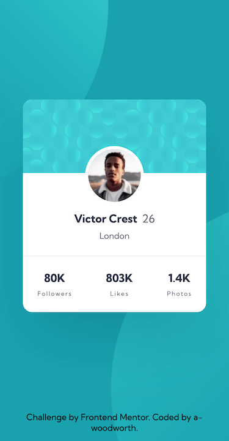

# Frontend Mentor - Profile card component solution

This is a solution to the [Profile card component challenge on Frontend Mentor](https://www.frontendmentor.io/challenges/profile-card-component-cfArpWshJ).

## Table of contents

- [Overview](#overview)
  - [The challenge](#the-challenge)
  - [Screenshots](#screenshots)
  - [Links](#links)
  - [Built with](#built-with)

## Overview

### The challenge

- Build out the project to the designs provided

### Screenshots

**Desktop**

**Mobile**

### Links

- Solution URL: [Solution](https://www.frontendmentor.io/solutions/profile-card-component---bem-css-custom-properties-gKgkNawGgH)
- Live Site URL: [Live Site](https://a-woodworth.github.io/profile_card_component)

### Built with

- Semantic HTML5 markup
- CSS Custom properties (variables)
